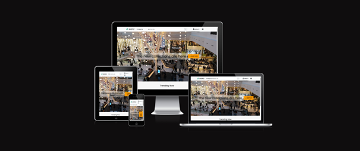
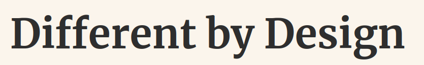

<!-- Hero Banner -->
<p align="center">

<table>
<tr>
<td width="50%" align="center" valign="middle">

<h1>🧠 Patrick</h1>


</td>

<td width="50%" align="center">
    
</td>
</tr>
</table>

</p>

<!-- About -->
```console
$ whoami

Full-Stack Web Developer
Security & AI systems enthusiast
Game Developer hobbyist

$ currently_building

> Full-Stack Blackjack game with AI Opponents and Multiplayer
> Linux Anti-Virus Automation
> Computer Science Bachelor’s degree in Science 
```

<!-- Skills -->
<p align="center">


</p>

```console
> loadout

## Frontend: React
## Backend: Django / Flask / Python
## Cloud: AWS / Azure
## DB: Postgres / MongoDB
```
---
<br>
<!-- Stats -->
<p align="center">

<table>
<tr>
<td align="center" colspan="2">
    
</td>
</tr>

<tr>
<td align="center">
    
</td>

<td align="center">
    
</td>
</tr>
</table>

</p>

<br>

---
<br>

<!-- Feature -->
<h1 align="center">💻 Featured Project</h1>
<h4 align="center" style="font-weight: normal; color: #555;">
Level 6 - Capstone Project | Full-Stack Deployment | E-Commerce Platform
</h4>

<div align="center">

</div>

<p align="center">


</p>

### **Shoply**
*E-Commerce Platform • Hosted on Heroku • CI/CD via GitHub*

- Populates products dynamically via Kaggle datasets
- Secure Stripe integration for payments
- Mobile-first responsive design
- Automated tests & CI/CD

<br>

<!-- Personal Blog -->
<div align="center">

<h1>🌱 Insights & Advocacy</h1>
<h4 style="font-weight: normal; color: #eebb5c;">
Navigating tech with ADHD, Autism, Dyspraxia & IBD
</h4>

<a href="https://www.patrickodoherty.dev">

</a>

<p>
<a href="https://www.patrickodoherty.dev">

</a>&nbsp;&nbsp;
<a href="https://www.linkedin.com/in/patricksadvocacy/">

</a>
</p>

</div>
<!-- Contributions Snake -->
<p align="center">

</p>
